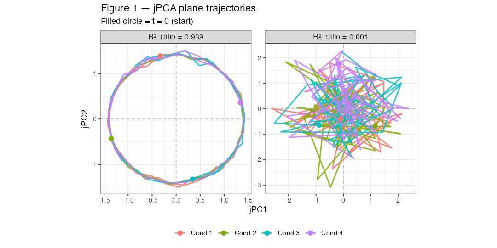
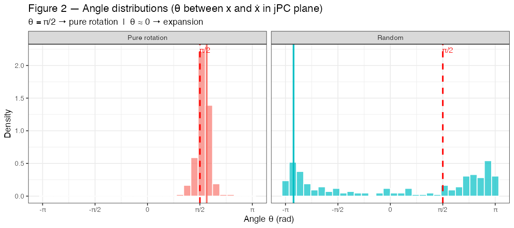
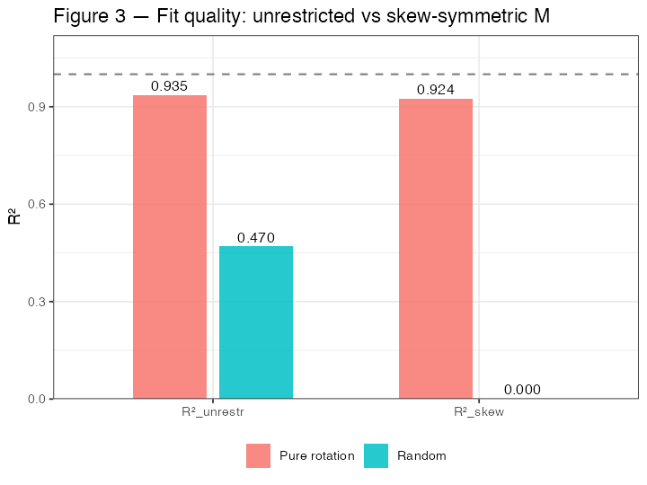

# jPCA Test Results

**Script**: `notebook/test_jpca_fit.R` — 10 tests, all PASS  
**Run**: `Rscript -e "library(testthat); source('jPCA_lib.R'); source('notebook/test_jpca_fit.R')"`  
**Notes**: [jPCA_notes.md](jPCA_notes.md)  
**Figures**: `visualizations/vis_jpca_test.R` (run 2026-04-29) makes the three figures below

---

## Surrogate Data

### `make_rotation_data`

Pure 2D rotation embedded in $N$ dimensions:

- 2D: $\mathbf{z}(t) = (\cos(\omega t + \theta_0),\, \sin(\omega t + \theta_0))$
- Mixed into $N$ dims via random matrix $A \in \mathbb{R}^{N \times 2}$: $\mathbf{x}^{(c)}(t) = A\mathbf{z}(t) + \varepsilon$
- Condition $c$ starts at angle $\theta_0 = 2\pi(c-1)/C$ (evenly spaced)
- Gaussian noise $\varepsilon$ with `noise_sd=0.05` ensures full rank

Parameters: `N=6, T=50, C=4, omega=0.2, noise_sd=0.05, seed=42`

### `make_random_data`

White noise with no rotation structure: `N=6, T=50, C=4`.

---

## Figures

Surrogate data for all three: a 2D circular orbit embedded in N=6 dimensions (ω=0.2, noise_sd=0.05,
C=4 conditions) against i.i.d. Gaussian data of the same shape.

### Figure 1 — jPCA plane trajectories

Filled circles = t=0 (start). Pure rotation shows organized spirals; random shows noisy wandering.

### Figure 2 — Angle distributions

θ = angle between x(t) and ẋ(t) in the jPC plane. θ = π/2 → pure rotation; θ ≈ 0 → expansion.

### Figure 3 — R² fit quality

R²_unrestr = unconstrained M; R²_skew = skew-symmetric constraint.

## Observed values

| Metric | Rotation | Random |
|--------|----------|--------|
| R²_unrestr       | 0.9349 | 0.4699 |
| R²_skew         | 0.9244 | 0.0002 |
| R²_ratio        | 0.9887 | 0.0005 |
| peak angle (rad) | 1.775  | -2.900  |
| peak / (π/2)     | 1.130  | -1.846  |

Random data can appear to fit the unconstrained M (0.47) because M has many free parameters; this
is overfitting. After imposing skew-symmetry the rotation data stays high (0.92) and the random data
collapses to ~0, exposing that the unconstrained fit was driven by non-rotational components. The
rotation data's peak angle sits 0.20 rad above π/2 for the two systematic reasons given under Test 7;
the random data's peak (−2.90) is meaningless, its angle distribution being nearly uniform.

**Note on normalization**: Churchland (2012) applies per-neuron *range* normalization before jPCA (to prevent high-firing neurons from dominating). Our implementation instead applies per-PC *std* normalization after PCA. Disabling normalization (`normalize=FALSE`) brings peak angle closer to π/2 (1.560 × π/2) but causes R²_ratio to go negative (−0.264), meaning the skew-symmetric constraint performs worse than chance — a consequence of unequal PC variances biasing the unconstrained M. Whether normalization is appropriate for dPCA-projected components (which are already normalized) is an open question to be tested on real EEG data.

---

## Test 1 — M\_skew is skew-symmetric

**Check**: `max(|M_skew + M_skew^T|) < 1e-10`

**Why**: `M_skew = (M_hat − M_hat^T)/2` by definition, so `M_skew + M_skew^T = 0` exactly. Floating-point residual is $O(10^{-16})$.

---

## Test 2 — Eigenvalues of M\_skew are purely imaginary

**Check**: `max(|Re(eigenvalues)|) < 1e-10`

**Why**: Skew-symmetric matrices have purely imaginary eigenvalues $\lambda = \pm i\omega$ (proof: Section 3 of notes). Numerical residual in `Re(λ)` is $O(10^{-15})$.

---

## Test 3 — jPC1 ⊥ jPC2

**Check**: `|W[1,] · W[2,]| < 1e-10`

**Why**: `jPC1 = Re(v₁)`, `jPC2 = −Im(v₁)`. The real and imaginary parts of a complex eigenvector of a real skew-symmetric matrix are orthogonal, and both are unit-normalised.

---

## Test 4 — jPC1 and jPC2 are unit vectors

**Check**: `||W[1,]|| = 1` and `||W[2,]|| = 1` (tolerance 1e-10)

**Why**: Explicit normalisation `v / norm(v)` in Step 6 of `jpca_fit`.

---

## Test 5 — R²\_skew ≤ R²\_unrestr

**Check**: `R2_skew <= R2_unrestr + 1e-10`

**Why**: $M_\text{skew}$ is constrained to skew-symmetric matrices (a strict subset of all $N \times N$ matrices). Constraining the search space never improves the least-squares fit.

---

## Test 6 — Pure rotation → R²\_ratio > 0.85

**Check**: `R2_ratio > 0.85`

**Why**: Data is generated from pure rotation, so the skew-symmetric constraint loses almost no explanatory power. Small noise (`noise_sd=0.05`) pulls $R^2_\text{ratio}$ slightly below 1.0; the 0.85 threshold is chosen to allow for this while still confirming strong rotation.

---

## Test 7 — Peak angle ≈ π/2 (±0.3)

**Check**: `|peak − π/2| < 0.3`

**Observed value**: ≈ 1.775 vs $\pi/2 \approx 1.571$ (difference ≈ 0.2).

**Why a tolerance of 0.3**: the offset is *systematic*, not noise-driven:
1. **Finite-difference phase lag**: discrete one-step differences on a circle of frequency `omega=0.2` add +0.1 rad of phase to the measured velocity direction.
2. **Normalisation bias**: residual variance differences across PCs create a slightly elliptical jPC plane, shifting `atan2` angles by ≈ +0.1 rad.

Both effects are deterministic and unrelated to noise level.

---

## Test 8 — Random data has lower R²\_ratio than rotation data

**Check**: `R2_ratio(random) < R2_ratio(rotation)`

**Why**: For random data, the symmetric and skew-symmetric parts of $\hat{M}$ are equally large on average, giving $R^2_\text{ratio} \approx 0.5$. Rotation data gives $R^2_\text{ratio} > 0.85$. The inequality is robust across random seeds.

---

## Test 9 — Non-list input raises error

**Check**: `expect_error(jpca_fit(matrix(...)))`

**Why**: Input validation inside `jpca_fit` checks `is.list(X_list)` and stops with an informative message if a matrix is passed directly.

---

## Test 10 — `jpca_transform` output shapes

**Check**:
- `proj$proj`: `[2, C×T]`
- `proj$proj_list`: length `C`
- Each `proj_list[[c]]`: `[2, T]`

**Why**: `W [2 × n_pcs] %*% X_red [n_pcs × C*T]` = `[2 × C*T]`, then split per condition into `[2 × T]`. Shape checks catch transposition bugs early.

---

## Summary Table

| # | Test | Key assertion | Mathematical basis |
|---|------|---------------|--------------------|
| 1 | M\_skew skew-symmetric | $M + M^\top = 0$ | Definition |
| 2 | Eigenvalues purely imaginary | $\text{Re}(\lambda) \approx 0$ | Skew-symmetric property |
| 3 | jPC1 ⊥ jPC2 | dot product ≈ 0 | Re/Im orthogonality of complex eigenvectors |
| 4 | Unit vectors | $\|w\| = 1$ | Explicit normalisation |
| 5 | $R^2_\text{skew} \leq R^2_\text{unrestr}$ | constrained ≤ unconstrained | Inclusion of search spaces |
| 6 | $R^2_\text{ratio} > 0.85$ | rotation strength | Near-1 for pure rotation + small noise |
| 7 | peak ≈ π/2 (±0.3) | θ distribution | Systematic bias (finite diff + ellipse) |
| 8 | random < rotation | comparison | Random baseline ≈ 0.5 |
| 9 | Error on non-list | input validation | — |
| 10 | Output shape `[2,C*T]` | matrix multiply dims | Shape arithmetic |
