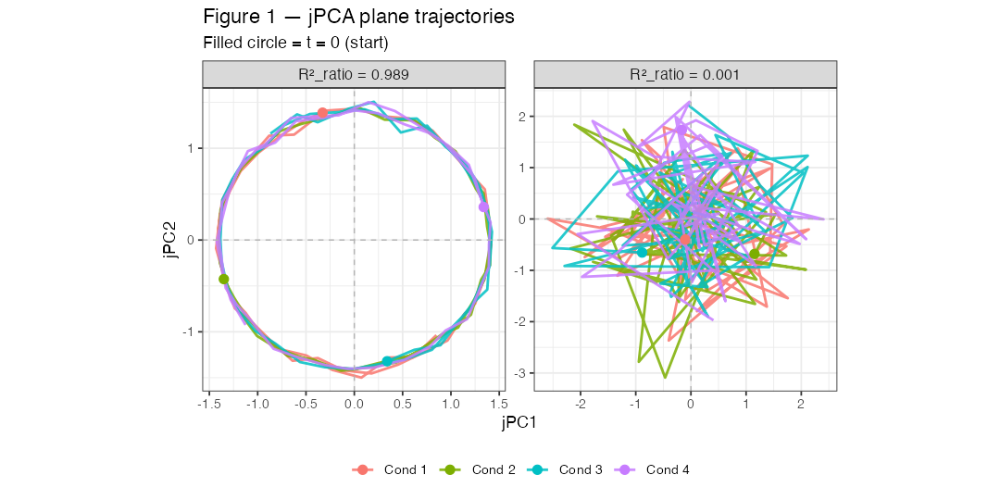
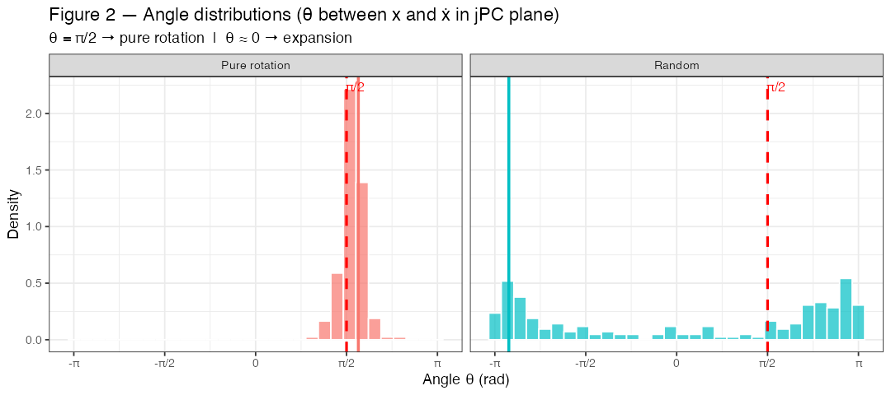
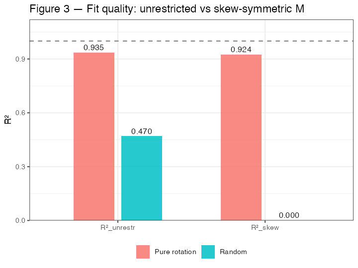

# jPCA Test Visualizations

_Generated: 2026-04-29 19:43_

## Surrogate data
- **Rotation**: 2D circular orbit embedded in N=6 dims, ω=0.2, noise_sd=0.05, C=4 conditions
- **Random**: i.i.d. Gaussian, same shape

---

## Figure 1 — jPCA plane trajectories

Filled circles = t=0 (start). Pure rotation shows organized spirals; random shows noisy wandering.

---

## Figure 2 — Angle distributions

θ = angle between x(t) and ẋ(t) in the jPC plane. θ = π/2 → pure rotation; θ ≈ 0 → expansion.

---

## Figure 3 — R² fit quality

R²_unrestr = unconstrained M; R²_skew = skew-symmetric constraint.

---

## Background

jPCA models neural state dynamics as:

> ẋ(t) ≈ M x(t)

M is estimated two ways:
- **M_unrestr**: unconstrained least-squares solution — can represent rotation, expansion, shear, etc.
- **M_skew**: constrained to be skew-symmetric (M = −Mᵀ) — represents **pure rotation only**

The skew-symmetric constraint is the core assumption of jPCA: if the constraint costs little (R²_ratio ≈ 1), the data are genuinely rotational.

---

## Numerical summary

| Metric | Rotation | Random |
|--------|----------|--------|
| R²_unrestr       | 0.9349 | 0.4699 |
| R²_skew         | 0.9244 | 0.0002 |
| R²_ratio        | 0.9887 | 0.0005 |
| peak angle (rad) | 1.775  | -2.900  |
| peak / (π/2)     | 1.130  | -1.846  |

**R²_unrestr**: fit of unconstrained M (upper bound). Random data can appear to fit (0.47) because M has many free parameters — this is overfitting.

**R²_skew**: fit after imposing skew-symmetry (= constraining M to pure rotation). Rotation data stays high (0.92); random data collapses to ~0, exposing that the unconstrained fit was driven by non-rotational components.

**R²_ratio = R²_skew / R²_unrestr**: how much the skew-symmetric constraint costs. Near 1 → data are intrinsically rotational. Near 0 → constraint destroys the fit.

**peak angle**: most frequent angle θ between position x(t) and velocity ẋ(t) in the jPC plane. θ = π/2 means velocity is perpendicular to position → pure counter-clockwise rotation. Rotation data peaks at 1.775 rad ≈ 1.13 × (π/2), offset from π/2 by ~0.20 rad due to two systematic biases: (1) finite-difference approximation of ẋ shifts θ by +ω/2 = +0.10 rad regardless of noise; (2) per-PC std normalization distorts the circular orbit into an ellipse, adding further offset. These are expected artifacts of the implementation, not noise. Random data's peak (−2.90) is meaningless — the angle distribution is nearly uniform.

**Note on normalization**: Churchland (2012) applies per-neuron *range* normalization before jPCA (to prevent high-firing neurons from dominating). Our implementation instead applies per-PC *std* normalization after PCA. Disabling normalization (`normalize=FALSE`) brings peak angle closer to π/2 (1.560 × π/2) but causes R²_ratio to go negative (−0.264), meaning the skew-symmetric constraint performs worse than chance — a consequence of unequal PC variances biasing the unconstrained M. Whether normalization is appropriate for dPCA-projected components (which are already normalized) is an open question to be tested on real EEG data (see ARCHITECTURE.md §15).

---

## Algebraic test results

| Test | Value | What it checks |
|------|-------|----------------|
| M_skew + t(M_skew) max abs | 0.00e+00 | M_skew is exactly skew-symmetric (M = −Mᵀ) |
| Re(eigenvalues) max abs    | 0.00e+00 | Eigenvalues are purely imaginary (skew-symmetric matrices have no real part) — pure oscillation, no growth or decay |
| jPC1 · jPC2               | 0.00e+00 | jPC1 ⊥ jPC2 (Re and Im parts of a complex eigenvector are always orthogonal) |
| ‖jPC1‖                    | 1.0000000000 | Unit vector (correct normalization) |
| ‖jPC2‖                    | 1.0000000000 | Unit vector (correct normalization) |
| R²_skew ≤ R²_unrestr     | 0.9244 ≤ 0.9349 | Constrained fit ≤ unconstrained fit (basic optimization guarantee; violation would indicate a bug) |